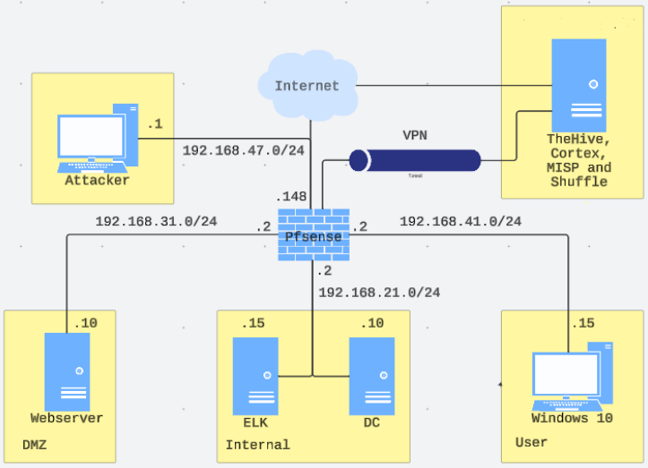
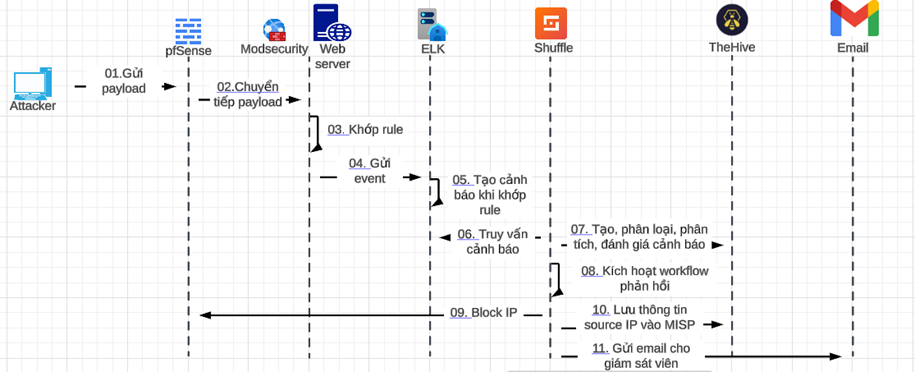
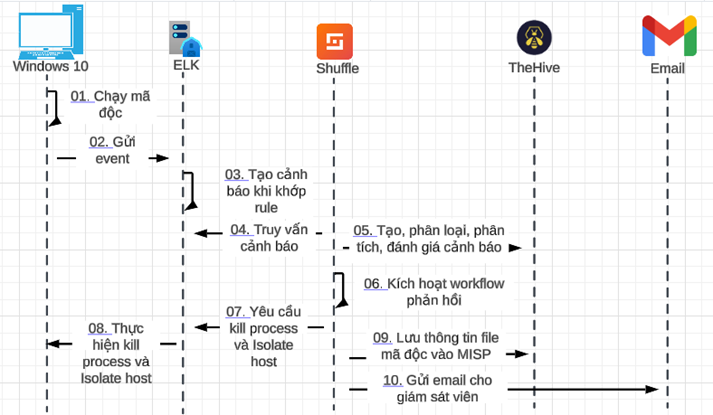
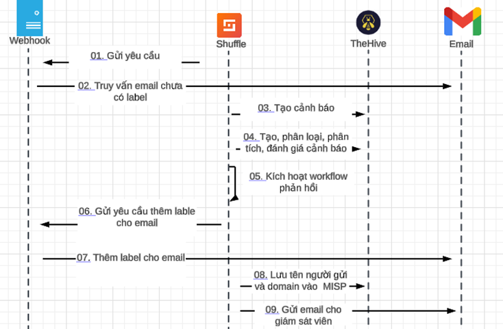

# Deploy an automated security incident monitoring and response system
The incident monitoring and response system model will be implemented as shown in Figure 1. The network model will consist of three main zones: DMZ, Internal, and User, all interconnected through the pfSense firewall. The Webserver, ELK, DC, and Windows 10 machines will each have agents installed, which will automatically send logs to ELK.

The ELK system will be configured with predefined rules, and upon receiving logs from the agents, if the logs meet the specified conditions, alerts will be automatically generated.

Additionally, platforms such as TheHive, MISP, Cortex, and Shuffle will be deployed using Docker on a VPS. The VPS and pfSense will be connected via a VPN, communicating through a third-party VPN. Shuffle will periodically query alerts on ELK, and if new alerts are found, Shuffle will create alerts in TheHive. Then, Shuffle will query alerts on TheHive periodically for classification, analysis, and assessment. If the assessment result is True Positive, the response workflow will be triggered. Conversely, if the result is False Positive, the workflow to close the case will be activated.

Finally, an Attacker machine with IP 192.168.47.1 will perform an attack on pfSense’s WAN IP (192.168.47.148), and necessary services will be NATed to this WAN IP

*Figure 1: Model deployment*

## Practice 1: Detection and blocking of IP exploiting CVE-2021-26084 (Scenario 1)

*Figure 2: Detection and blocking of IP exploiting CVE-2021-26084*

## Practice 2: Detection and response to CVE-2023-38831 exploitation (Scenario 2)

*Figure 2: Detection and response to CVE-2023-38831 exploitation*

## Practice 3: Detection and tagging of phishing emails (Scenario 3)

*Figure 2: Detection and tagging of phishing emails*